# SvelteKit Part 2

Enda Lee 2023

### Quick Start

1. Download the code from this repository (FORK or download as zip - DO NOT CLONE)
2. Open in VS Code
3. In a terminal run **`npm install`**
4. Start the application using **`npm run dev`**

## Introduction

This lab will cover the following topics:

1. Server-Side rendering (SSR) vs Client-Side Rendering.
2. Environment variables and keeping secrets safe.
3. Passing parameters via the URL.
4. Handling events.
5. Exercises.


## 1. Server-Side Rendering (SSR)

**`Server-Side Rendering`** allows the initial page content to be generated on he `Server-Side`. There are a number of advantages, including:

1. Content immediately available for user interaction.
2. Content is accessible to search engine robots.

Another advataage is security and privacy. Secrets such as API keys, crypto keys, passwords, etc. should not be be accessible on the client-side. 

When JS fetch is used to obtain data from an API from the browser, the API key must be included in the script. The current NASA APOD page is an example of this as the key can be viewed using the browser developer tools (intentionally blurred in this example):

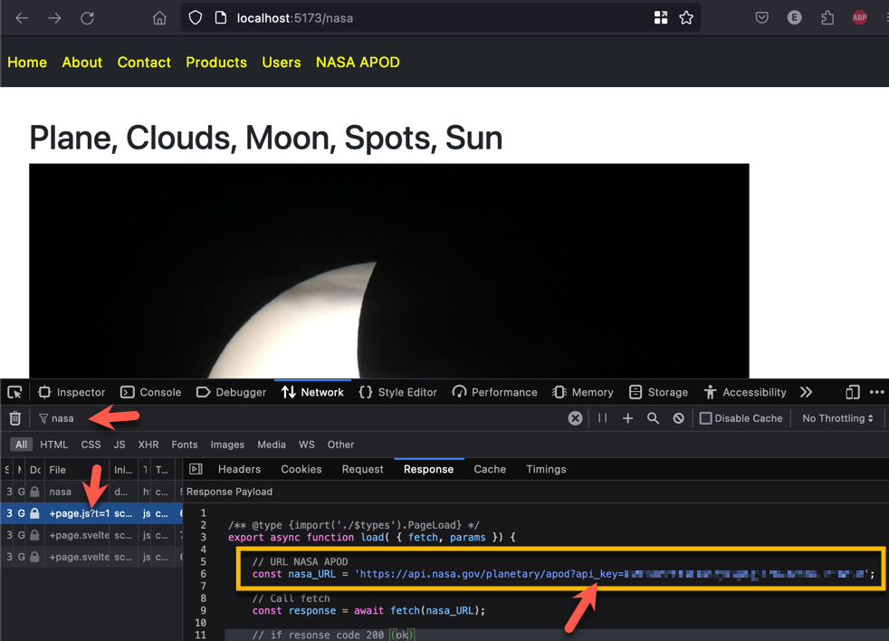

[SvelteKit](https://kit.svelte.dev/docs/page-options) supports SSR and makes it easy to set CSR or SSR on a page by page basis. By default, pages are rendered client-side - this is why the NASA `+page.js` script can be viewd in the browser developer tools.

If the script page is renamed **`+page.server.js`** then its code will be executed, and content generated, server-side. Also note that the `JSDoc` import has also changed from `PageLoad` to **`PageServerLoad`**

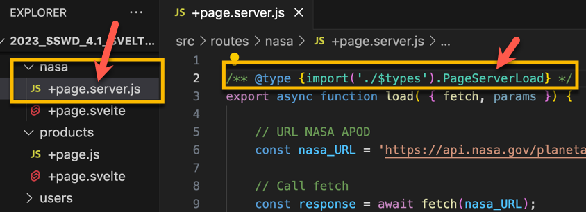

After making this change, reload the page and check if the script and  API Key are still visible in the browser.  

## 2. Environment Variables

It is very bad practice for security to hardcode secrets such as passwords, API Keys etc, in scripts or source code. Aside from being visible to who ever has access to the source-code, secrets may also end up in a code repository (eg. GitHub) where they will be accessible by anautorised members of the development team, or even be available publicly.  There are many high profile examples of this happening,  even if it is easy to prevent.

### 2.1 Using Environment Variables

These are values which are maintained by the Operating System or Environmebt on which an application is hosted. This could be a local OS or a cloud managed service. Secrets can be protected in this way and accessed in code as required without hardcoding the values. 

While developing an application, it is common to store Environment Variables in a file named  **`.env`** stored in the root of the application. Files with names starting with **`.`** are hidden by default in *nix (UNIX/ Linux) operating systems.

**Exercise:** Add a file named **`.env`** to the root of your SvelteKit application. Then VS Code and open for editing.

Add two variables, for the NASA API key and the APOD URL. [**The `VITE_` prefix is required by SvelteKit**](https://vitejs.dev/guide/env-and-mode.html#env-files)

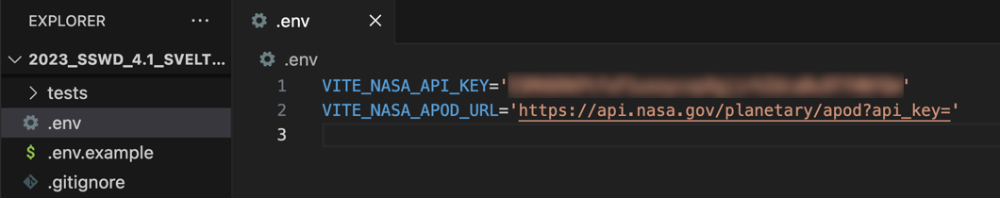

In SvelteKit, these variables are accessed using `import.meta.env.VITE_ENV_VAR` (where VITE_ENV_VAR is the name of your variable). 

**Exercise:** Update the NASA example to use these values:

```javascript
 // URL NASA APOD URL and API key
 const nasa_URL = `${import.meta.env.VITE_NASA_APOD_URL}${import.meta.env.VITE_NASA_API_KEY}`;
```

Now the values can be protected and also changed changed without editing the application code.

### 2.2 Tell Git to ignore `.env` (and other items which should not be in a repo)

Git uses a `.gitignore` file to specify which files and folders should not be uploaded to a repo.

The  `.gitignore`  in this application ignores `.env` (and other files/ folders) but includes `.env.example`

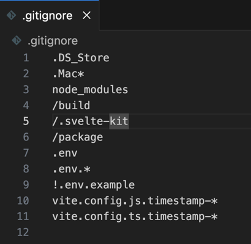


## 3. Passing parameters via the URL

Dynamic routes provide a way to pass paramters (values) to a page at runtime in order to generate dynamic content. 

In this example, the `/about` route will be modified so that if the URL includes a name a greeting will be displayed.

For example a route to  `/about/Bob` will display:

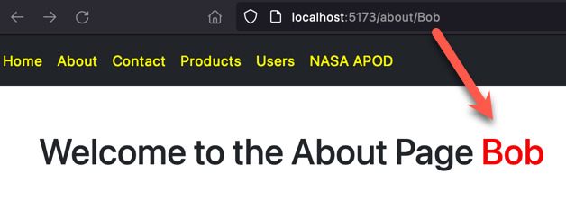

These dynamic routes are often refered to as **slugs**. To try it it:

1. Add a subfolder to the about route, named **`[name]`** (note the square brackets are required). 

   *If VS Code displays the path as `/about/[name]` that can be fixed by disabling  **Compact  Folders** in VS Code Preference or Settings.*

2. Then add `+page.js` and `+page.svelte` to the new folder so that it looks like this:

   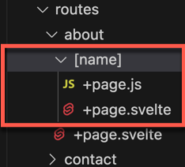

3. Add code to read the `name` parameter in `+page.js`

   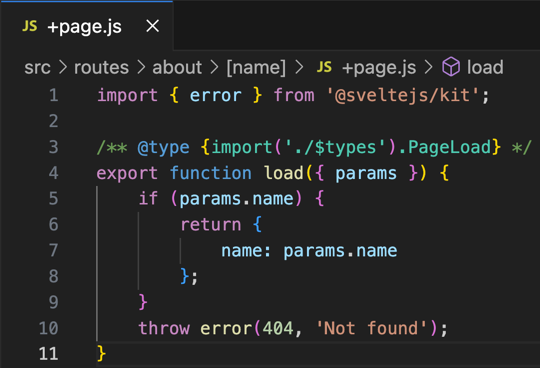

4. Display the greeting in `+page.svelte`

   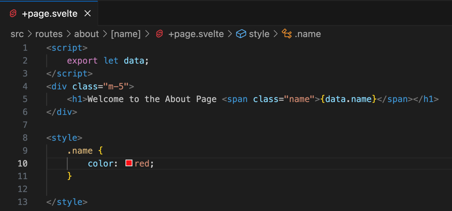


Try it out. If no name is entered, the about page should work as before, with no name. 

If a name is entered then it will be handled as the name parameter and displayed.

### 3.1 Add another parameter

Next, add another parameter which will define the number of times to display the welcome message, for example **`/Bob/3`** should display the Welcome mesage 3 times:

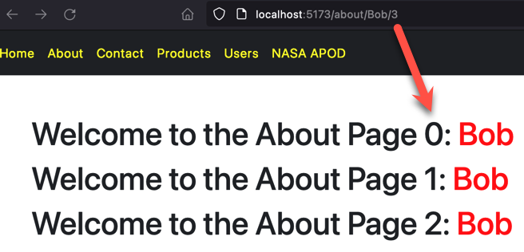 

1. Add a sub-folder named `repeat`  to `/about/[name]` 

2. Then add the usual  `+page.js` and `+page.svelte` to the new folder so that it looks like this:

   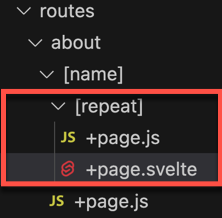

3. Add code to read the `name` and `repeat` params

   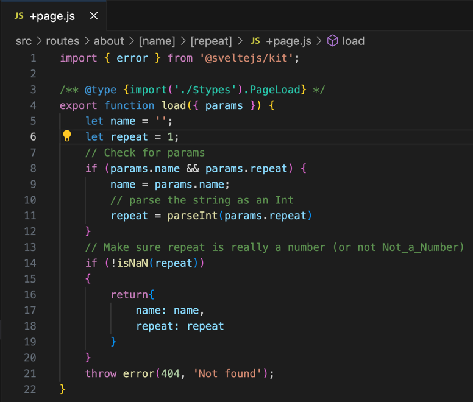

4. Display the repeated Welcome message

   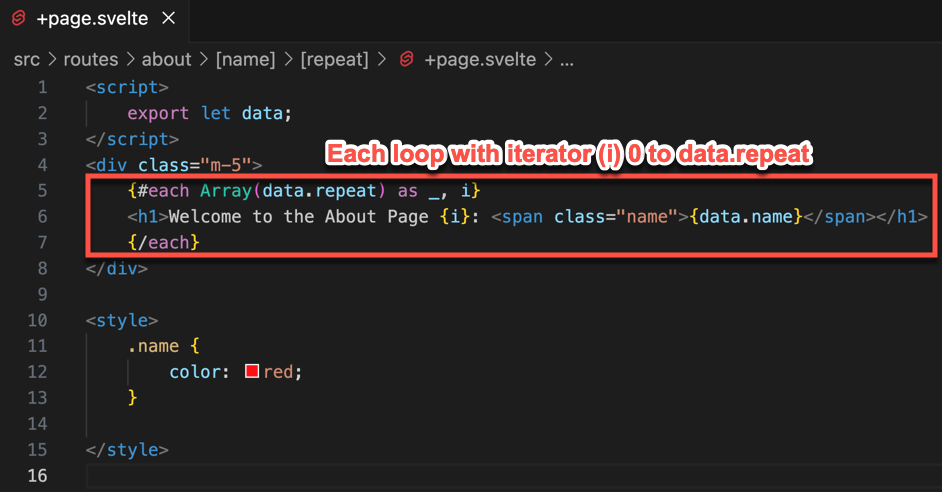


## 4. Handling Page events

Handling page events is useful as it allows content to be dynamically uopdated depending on `events` such as clicks, data entry, etc.

This example displays a running total. Each time a value is entered and the button clicked, the new value is added to the running total.

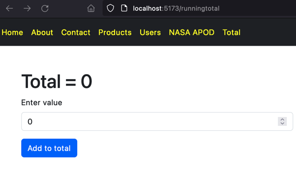

1. Start by adding a new `route` named `runningtotal` then add `+page.js` and `+page.svelte`.
2. Open `+page.svelte` and add code below - **read the comments for details**

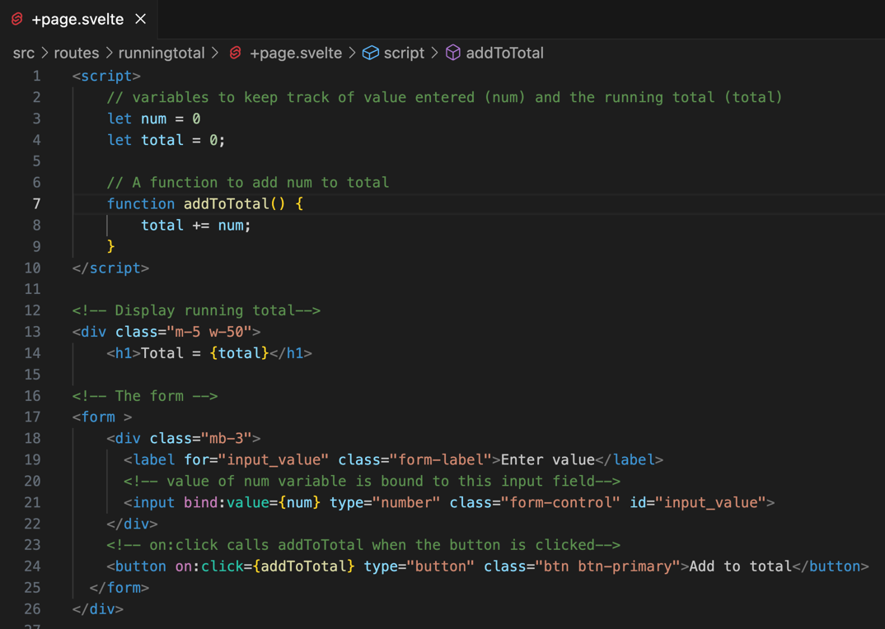


## 5. Exercises

1. Add functionality to allow the running total in part 4 to be reset (via a button click)

2. Build a simple calculator with the following functionality:

   * Allow the user to enter 2 numbers

   * Allow user to choose Add, Subtract, Multiply, or Divide

   * Validate the inputs

   * Display the input values and result (style appropriatly)

3. Add a new route which accepts two values and an operator (add, sub, multi, div). The perform the calculation and display the result.

## 6. References

SvelteKit Docs: https://kit.svelte.dev/docs/introduction

Svelte Docs: https://svelte.dev/docs/introduction    
